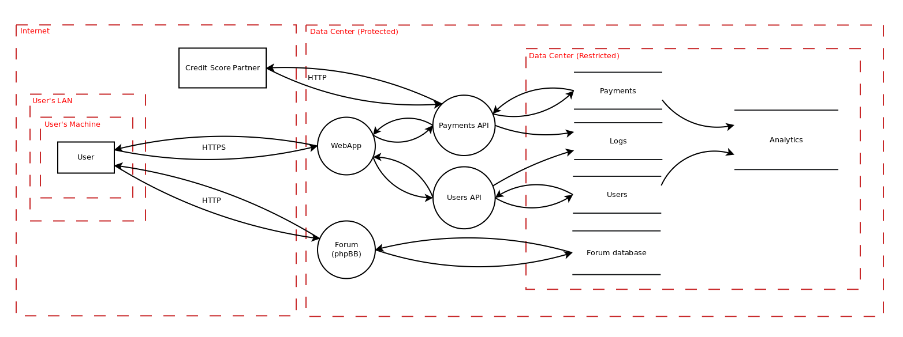

# Data Flow Diagramming shapes for [Dia](https://wiki.gnome.org/Apps/Dia)

[Data Flow Diagramming](https://en.wikipedia.org/wiki/Data_flow_diagram) is a
simple diagramming technique used to gain an understanding of how data flows in
an application or system. DFD diagrams are especially helpful when conducting
[threat modeling](https://www.owasp.org/index.php/Application_Threat_Modeling).

This project extends the free and open source [Dia](https://wiki.gnome.org/Apps/Dia)
diagramming tool with a new Sheet for doing DFD diagramming:

## Installation

Installation on Linux is pretty straight-forward:

 1. Check out the repository with `git clone https://github.com/michenriksen/dia-dfd.git`
 2. Make symbolic links to the diagram shapes with `ln -s /path/to/dia-dfd/shapes/* ~/.dia/shapes/`
 3. Make symbolic link to the diagram sheet with `ln -s /path/to/dia-dfd/sheets/dfd.sheet ~/.dia/sheets/`
 4. Restart Dia if it's already open

You should now have a new Sheet called DFD, ready to use.

**Happy diagramming!**
